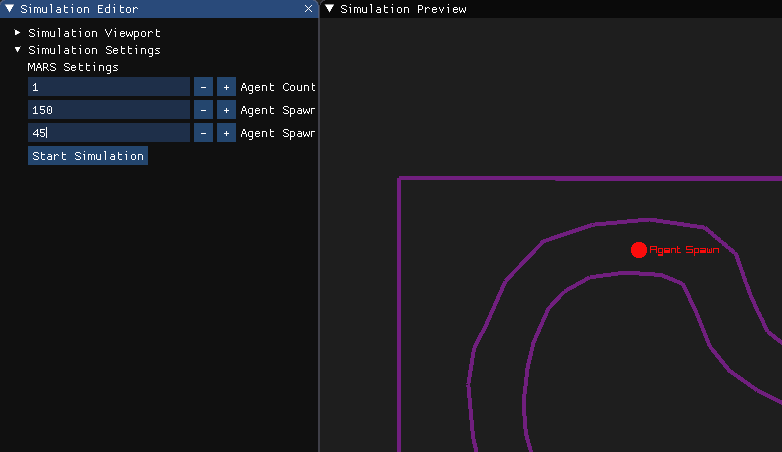
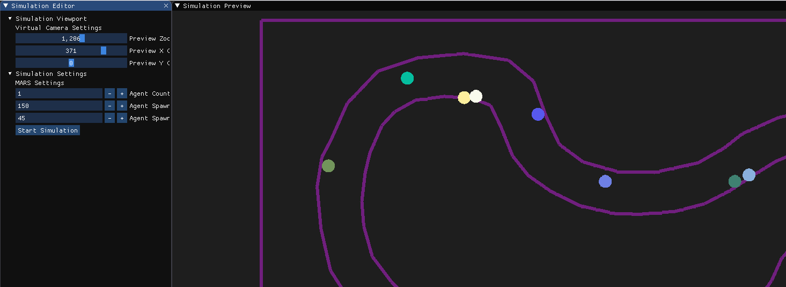
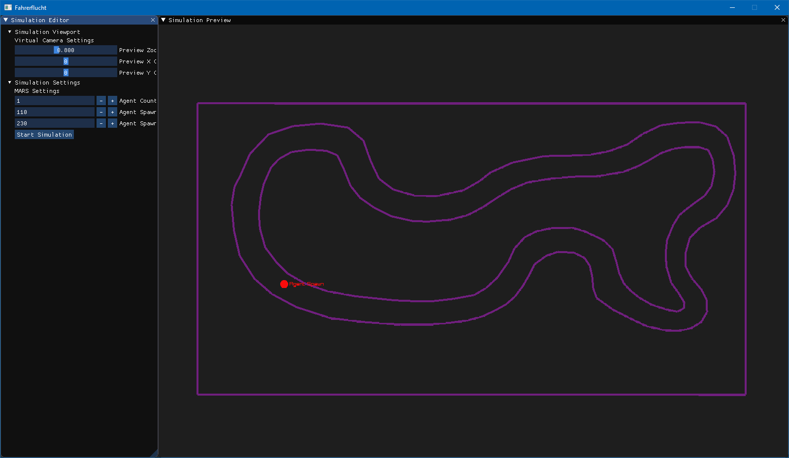
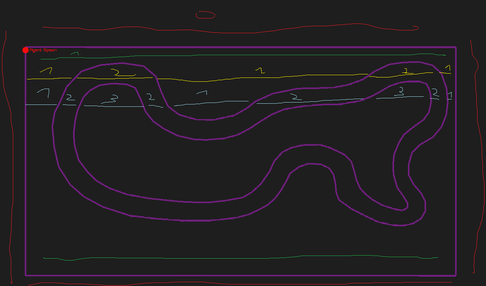
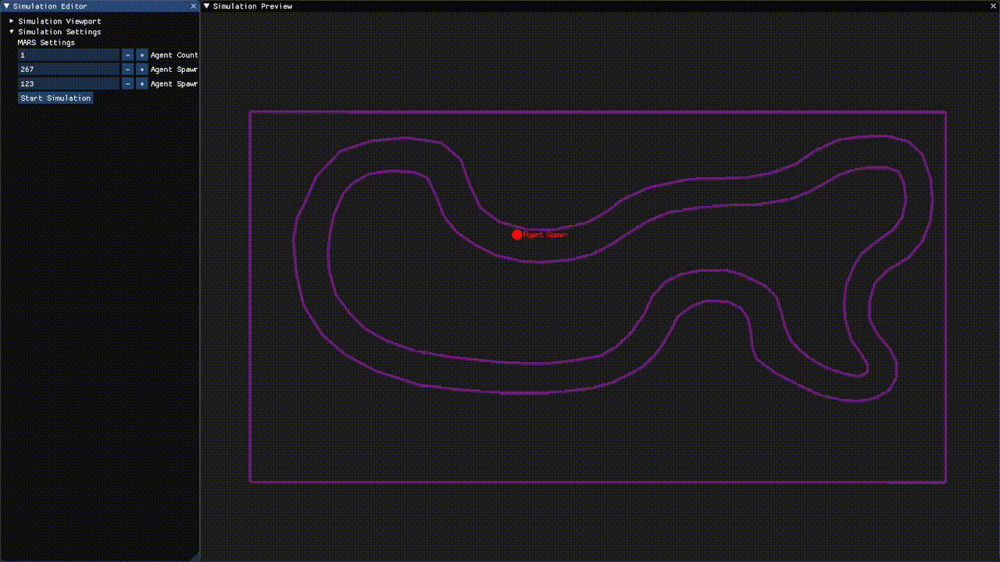

# Fahrerflucht

## Setup
1. Building / Ausführen
- Repository downloaden
- Ordner in Rider oder Visual Studio öffnen
	- .NET 6.0 wird benötigt!
- Nuget Pakete wiederherstellen (Dies macht Rider eigentlich automatisch beim öffnen)
- Projekt "Fahrerflucht" als Startprojekt auswählen
- "Fahrerflucht" bauen / ausführen.
2. Konfigurieren
- Agenten Spawn in den Track setzen, hierfür das UI verwenden (Agent Count Option wird z.Z. noch ignoriert, es werden 10 Agenten gespawnt)

- "Start Simulation" Knopf drücken

3. Einstellungen
- Während der Simulation kann über die Viewport Konfiguration das Sichtfeld verändert werden

## Rollenverteilung

|Rollen                 |Member                                 |
|-----------------------|---------------------------------------|
|Implementierung der AI |Finn-Lukas Armbruster, Daniel Bergmann |
|Visualisierung         |Benjamin Schröder                      |
|Testing                |Akif Aydin                             |
|Continuous Integration |Ahmet Kirdas                           |

## Ansprechpartner

|Gruppe  |Member          |
|--------|----------------|
|SimCity |Daniel Bergmann |
|Snake   |Akif Aydin      |

## Beschreibung
Evolutionäres NN, welches sich durch einen Hindernisparcour durchbewegen muss.
Dabei werden die unterschiedlichen Genome durch die Software Agenten dargestellt und tragen dabei alle zu einem evolutionären NN bei.
Dadurch repräsentieren die Agenten die unterschiedlichen Genome und adaptieren dadurch gemeinsam das NN.
Jeder Agent wird dabei ein Auto sein, welches mit Sensoren ausgestattet wird, welche die Umgebung / den Parkour wahrnehmen werden.
Die Sensordaten werden daraufhin an den Input Layer des NN weitergegeben (Mapping 1:1) und der Output Layer gibt daraufhin die Steuerungs Befehle der Autos aus.

## Vorschau

## Polygon Zonen
Das Layer wird über Polygone definiert. Die Agenten können nun punktuell Proben, ob sie / ein Punkt in wie vielen Polygonen liegen.
Die Grafik veranschaulicht dies und gibt an in wie vielen Polygonen sich ein Agent wo befindet. Daher kann ein Agent prüfen, ob er noch im Track ist,
wenn er in 2 Polygonen ist. Über diese Methode wird auch die Sicht der Agenten implementiert, in dem diese in ihrem Sichtfeld (ViewDistance) proben, ob sie dort den
Track verlassen (agent.position + ViewDistance in track).

## Random Agent Movement (Keine KI!)

## Vorgehen für die Präsentation

KI & Softwareagenten Präsentation

1. Fachlich
	- Projektidee
	- Evolutionärer Algorithmus
		- Evolutionären Ansatz erklären
		- Genome
		- Mutationen
		- Replikation
		
2. Technisch
	- Track Aufbau
		- QGIS --> geojson
		- Design 
		- Agenten --> Auto Darstellung
	- Anwendung des Evolutionären Algorithmus in unserem Projekt
		- N Eingaben / Sensoren
		- X Hiddenlayer / Neuronen (FCNN)
		- 2 Output Neuronen (L/R Vektor manipulation der Agenten (Bewegungsvektor))
		- Fitness Calculation mit den Checkpoints
		
3. Competition
	- Für die Ausführung des Programms kann in der "run.json" die Konfiguration vorgenommen werden. Jedes Team erstellt eine Gruppe von Agenten mit folgenden Eigenschaften:
		- name und color: beliebigen, nicht vergebenen Namen und Farbe auswählen
		- startposition: die Startposition muss innerhalb des Tracks sein
		- RandomSeed: Startwert für den Zufallszahlengenerator, welcher die NN-Ausprägungen generiert und mutiert 
		- Agentcount: Anzahl der Agenten [Je höher umso mehr Kosten]
		- MinKeepThreshold: Wie viele Genome / NN Ausprägungen mindestens in die Replikation / Mutationen eingebunden werden müssen [Je niedriger umso mehr Kosten]
		- ThresholdFitness: die Fitness berechnet sich durch das zurückgelegte Neuronales Netz und der ThresholdFitness gibt an, ab welchem Wert sich das Neuronale Netz nicht weiter fortpflanzt [Je höher umso mehr Kosten]
		- HiddenLayerCount: Anzahl der Hidden Layer [Je höher umso mehr Kosten]
		- HiddenNeuronCount: Anzahl der Hidden Neuronen [Je höher umso mehr Kosten]
		- Sensors: jeder Agent kann beliebig viele Sensoren mit folgenden Eigenschaften haben [Je mehr umso mehr Kosten]
			- Angle: Blickwinkel des Sensors (in Grad)
			- Range: Länge des Sensors [Je höher umso mehr Kosten]
	- Das Team, was die niedrigsten Kosten in Proportion zu dem Fortschritt hat, hat am Ende gewonnen.
	
